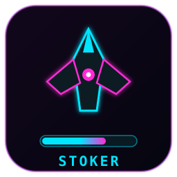

# STOKER

Live terminal fuel-watch dashboard for EVE Online Upwell structures.
A stoker keeps the furnaces fed; so does this.

Fuel-sorted by default so whatever runs dry first is on top.

## Running

**Windows:** unzip `stoker-windows-x64.zip` and double-click `stoker.exe`.
No terminal or PowerShell needed - Windows opens its own console window
(Windows Terminal on 11 looks best, the legacy console works too).
SmartScreen will warn about the unsigned download the first time: choose
"More info" then "Run anyway" (open-source build, no code-signing cert).
Needs Windows 10 version 1803+ (`curl.exe` ships with the OS).

**Linux:** untar `stoker-linux-x86_64.tar.gz` and run `./stoker`. Static
binary, needs only `curl` installed.

**Prefer a real window over a console?** Both archives also contain
`stoker-gui` / `stoker-gui.exe`: the identical dashboard in its own
native window (no terminal at all - on Windows it launches without a
console). Same keys, same config, same login; the first run opens the
EVE browser login with progress shown in the window.

First run opens your browser for an EVE login; approve the single
(read-only) structure permission and the dashboard appears. That's the
whole setup: the refresh token is kept locally so it's a one-time dance.
Your character needs the **Station_Manager** (or Director) in-game role,
or ESI refuses the corp structure list.

Standalone (EVE login) mode shows name / system / type / state / services /
fuel days for every corp structure. The 2ND FUEL column (Magmatic Gas on
Metenox drills, Liquid Ozone on Ansiblex gates and Pharolux beacons) reads
the structure fuel bay from corp assets. The login requests both read-only
scopes by default; the column needs the in-game Director role and shows
"?" without it. Set `"scopes"` in config.json to trim the request back
to structures-only if you prefer. Burn rates, bay estimates and the
refuel log are computed server-side by a hosted STOKER backend and show as
unknown without one.

**POS control towers (standalone):** with the in-game **Director** role,
classic starbases join the table as "POS" rows: real fuel-block counts
straight from the tower's bay (not a clock estimate), a synthesized
runout so the usual gauges/sorting/alerts work, a strontium meter shown
as hours of reinforcement it buys, and OFFLINE / REINFORCED / UNANCHORING
badges with the reinforcement countdown in the Timer slot. Towers in
systems where your alliance holds sovereignty burn 25% less; the details
panel says when that discount is applied. Tower attacks (TowerAlertMe)
flash UNDER ATTACK within ~10 minutes via notifications. Needs the
`esi-corporations.read_starbases.v1` scope on your login (re-login to
grant); without Director, POS rows simply stay hidden and the header
says why.

**Persistent refuel log (standalone):** ESI has no "someone fueled this"
event and the app keeps no database, so each poll reports the structure
list + fuel clocks it just pulled to a small history service, which diffs
snapshots over time and serves back your corp's refuel log (the `f` view).
The report contains exactly what your own ESI view returned: structure
ids, names, systems, and fuel expiry times, nothing else, no tokens.
Privacy switch: set `"history_api": ""` in config.json to disable, or
point it at your own server (two endpoints: `POST /report`,
`GET /refuels?corp_id=`; see the STOKER backend source). The shared
service is rate-limited per IP - far above the app's normal polling,
but don't hammer it.

**Timers and moon pulls (GUI):** every row shows shield/armor/hull dots and
a reinforcement countdown ("Timer: NONE" when safe). Athanors and Tataras
get a "Moon Pull:" countdown that follows the real chunk lifecycle: when
the timer lands the chunk does NOT pop - it sits in a ~3h fire window
(READY, with the time left) until someone fires the laser or it
auto-fractures at the ESI-supplied decay time. The actual pop is caught
from MoonminingLaserFired / MoonminingAutomaticFracture notifications
(the details panel says who pressed the button), then POPPED holds while
the asteroid field lives (48h base) and RESET means a new extraction
needs scheduling. Moon drilling rigs are read from corp assets and shown
on the details panel; they stretch both the fire window (ESI already
bakes that into the decay time) and the field life (+50% T1, +100% T2).
Moon pulls need the `esi-industry.read_corporation_mining.v1` scope on
your login (re-login to grant) plus the in-game Station Manager or
Director role; rig detection additionally needs corp-assets (Director).
Metenox rows also meter the moon material bay with its estimated market
value.

**Local awareness (GUI):** the map overlays your pilots' positions and
hostile intel by tailing the EVE client's own chat logs, SMT-style, no
ESI involved. All log reading runs on a dedicated watcher thread (the
same architecture SMT uses), so it never costs the UI a frame - and it
is therefore ON by default: `Documents/EVE/logs` is auto-detected, or
set `"eve_logs"` in config.json to a logs path directly, or to `"off"`
to disable the overlay entirely. Optional `"intel_channels": ["..."]`
names intel channels explicitly (default: any channel with "intel" or
".imperium" in its name). Intel systems ring red on the map and their
fuel-table rows flag red.

**Settings & filters (GUI):** the `settings` button opens levels you can
tune per structure type: a fuel *alert* (days) that feeds the `needs
fuel` toolbar filter, and a fuel *max* that sets each bar's cap and the
"[units] to [max]d" haul target - each structure's detail panel can
override both individually. The Metenox moon-material bar shows the flat
m3 stored (solid fill against a configurable "reads full at" volume).
The `flags` toolbar button toggles flagged-structures-only, using the
warning set chosen in settings (attacks, power states, anchoring,
timers, moon pulls - all on by default). Everything persists to
`prefs.json` next to the config.

**Window chrome (GUI):** STOKER draws its own title bar and neon border
instead of the OS decorations: drag the strip to move, drag any edge to
resize, double-click to maximize, and use the pin button to keep the
window on top of the EVE client. Set `"native_titlebar": true` in
config.json for the stock OS window (Wayland sessions get it
automatically, since Wayland forbids apps moving their own windows).

**Updates:** on startup STOKER checks the newest GitHub release once; if
a newer version exists the header offers it and `u` downloads and swaps
the binary in place (restart to run it). Set `"update_check": false` in
config.json to disable. Since v2.10.0 releases are Ed25519-signed: the
updater only offers releases that ship a `.sig` beside the archive and
refuses to install anything that fails verification against the public
key baked into the binary, so a hijacked GitHub account alone cannot push
code onto your machine.

**Multiple corps:** press `alt+c` in the app (or run `stoker --add`) to log
in another character. Every corp your characters can read gets its own tab
(labeled by corp ticker); press `c` to switch. With access to just one corp there is no tab bar,
the dashboard looks exactly as before. Two characters in the same corp
share one tab, and a character without the in-game role simply
contributes nothing.

### Skyhook watch (optional)

Add a `"skyhook_watchlist"` array to config.json to track Orbital
Skyhooks alongside your structures (they get their own type tab):

    "skyhook_watchlist": [
      {"planet_id": 40000001, "system": "X-XXXX", "planet_roman": "I",
       "hourly_isk": 800, "monthly_rent_isk": 144000}
    ]

Only `planet_id` is required; the income figures are optional display
extras. Theft (raid) windows come straight from the public game-wide
ESI raidable feed, no login or scopes needed: each hook shows a
countdown when its next window is announced, an amber WINDOW SOON
badge, and a flashing red RAIDABLE while the window is open.

With a watchlist configured, every other skyhook in the game that has
a window announced or open is listed too, tagged (gas)/(ice), sorted
open-first then soonest. Set `"skyhook_all": false` to keep only your
watchlist, or `"skyhook_all": true` to get the game-wide list with no
watchlist at all.

### Corp mode

If whoever hosts a STOKER backend gave you an endpoint URL and access key,
run `stoker --corp` once and paste them in. Full feature set: usage-based
burn rates, bay estimates, refuel log, refuel claims, doctrine ozone tiers.
Settings live in `~/.config/stoker/config.json` (Windows:
`%APPDATA%\stoker\config.json`); env overrides `STOKER_ENDPOINT`,
`STOKER_KEY`, `STOKER_CLIENT_ID`.

Set the `STOKER_NAME` environment variable so `[1]` refuel claims are
stamped as you (corp mode only).

## Keys

| Key | Action |
| --- | --- |
| up/down, pgup/pgdn, wheel | scroll |
| tab | cycle structure-type filter |
| s | cycle sort (fuel / type / system / name / need) |
| / | text filter (Enter apply, Esc clear) |
| space | (TUI) tally-mark the highlighted row; the totals line then sums only marked rows (Esc clears) |
| ctrl+click / shift+click | (GUI) build a hauling tally: the detail panel shows total m3 to move (blocks/gas/ozone to 30d + Metenox cargo pickup), each structure's exact load-in/take-out, jump counts from your pilot via gates + jump bridges, and a set-destination button per stop. Skyhooks can't join a batch |
| f | refuel log |
| c | switch corp tab (when more than one corp is visible) |
| alt+c | add another character (standalone) |
| right arrow | detail page for selected structure (left/Esc back) |
| 1 | "I fueled this" claim on the selected refuel event (corp mode) |
| r | request a fresh pull |
| q | quit |

## Building

Portable build via CMake (fetches FTXUI v5.0.0 automatically):

    cmake -S . -B build && cmake --build build -j

Release packages for both platforms (needs `g++-mingw-w64-x86-64-posix`
for the Windows cross build):

    ./build-release.sh

The script Ed25519-signs both archives with the key in
`~/.config/stoker-release/` (create one with `tools/stoker-sign keygen`;
its public half must match `UPDATE_PUBKEY_HEX` in `bpos-dash.cpp`) and
fails hard without it. Upload the `.sig` files as release assets next to
the archives or self-update will ignore the release.

## Notes

- No secrets ship in the source or release binaries. Corp-mode keys live in your
  local config file; standalone uses EVE SSO with PKCE (public client, no
  app secret) and stores tokens with owner-only permissions.
- ESI has no "who fueled it" event, so BY comes from `[1]` claims and
  refuel block counts are estimates (days added x the structure's service
  burn rate). Fuel-bay contents (the F² column) are only visible through
  Director-scoped corp assets; without that they show "?".
